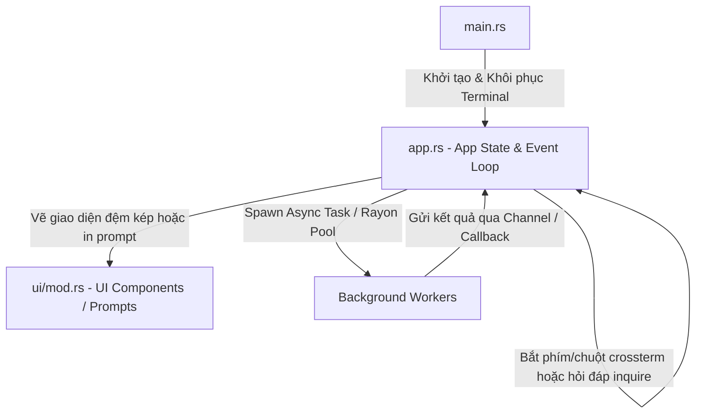

# Quy Chuẩn Phát Triển & Sửa Lỗi Ứng Dụng Rust TUI (`rust-tui-development`)

Tài liệu này đóng vai trò là **Bộ quy chuẩn kỹ thuật (Standard Operating Procedures)** dành cho Agent khi thiết kế, phát triển và sửa lỗi cho bất kỳ ứng dụng giao diện dòng lệnh Terminal User Interface (TUI) nào được viết bằng Rust.

Quy chuẩn này chia làm 2 trường phái TUI chính trong Rust:
1. **Full-screen Dashboard TUI** (sử dụng `ratatui` + `crossterm` điều hướng phím vẽ lưới màn hình).
2. **Interactive Prompt/Wizard TUI** (sử dụng `inquire` + `indicatif` để hỏi đáp, nhập liệu và hiển thị tiến trình).

---

## 1. Kiến Trúc Luồng Ứng Dụng TUI Chuẩn

Mọi ứng dụng Rust TUI cần tuân theo cấu trúc phân tách rõ ràng giữa Trạng thái dữ liệu (`AppState`), Giao diện hiển thị (`UI Render`) và Vòng lặp sự kiện (`Event Loop`).



### Quy tắc tổ chức Code:
- `src/main.rs`: Điểm khởi đầu ứng dụng, thiết lập Terminal, cài đặt Panic Hook, kiểm tra TTY và chạy Event Loop chính.
- `src/app.rs`: Quản lý Trạng thái Ứng dụng (`App` hoặc `Context` struct) và điều phối các lệnh logic.
- `src/ui/`: Thư mục chứa các module con vẽ giao diện hoặc các biểu mẫu prompt (ví dụ: `prompt.rs`, `explorer.rs`).
- `src/app_config.rs`: Cấu hình ứng dụng và lưu trữ trạng thái lâu dài.

---

## 2. Bảo Vệ Terminal Mode & Xử Lý Sự Kiện (Terminal Safety)

### 2.1. Phục Hồi Chế Độ Raw Mode Khi Xảy Ra Sự Cố (Panic Hook)
Khi ứng dụng TUI bật Raw mode (`crossterm::terminal::enable_raw_mode()`), bàn phím và con trỏ chuột sẽ được kiểm soát hoàn toàn. Nếu ứng dụng bị crash (`panic!`), terminal sẽ bị kẹt ở raw mode khiến người dùng không thể nhập liệu bình thường.
- **Giải pháp**: Luôn đăng ký một Panic Hook tùy chỉnh ở đầu hàm `main()` để dọn dẹp và khôi phục Terminal trước khi in log lỗi:
```rust
let default_panic = std::panic::take_hook();
std::panic::set_hook(Box::new(move |info| {
    let _ = crossterm::terminal::disable_raw_mode();
    let _ = crossterm::execute!(std::io::stdout(), crossterm::terminal::LeaveAlternateScreen);
    default_panic(info);
}));
```

### 2.2. Kiểm Tra TTY & Tự Động Bọc Terminal Emulator (Terminal Wrapping)
Khi người dùng chạy ứng dụng trực tiếp từ trình quản lý file đồ họa, ứng dụng sẽ thiếu môi trường TTY hợp lệ và lập tức thoát hoặc lỗi.
- **Giải pháp**: Kiểm tra xem stdout có phải là TTY hay không. Nếu không, dò tìm terminal emulator khả dụng (`gnome-terminal`, `konsole`, `alacritty`...) để spawn chính ứng dụng chạy trong đó.
- **Chú ý**: Đặt biến môi trường (ví dụ: `RCLONE_TUI_WRAPPED=1`) khi spawn để tránh tạo vòng lặp vô hạn (Recursive Wrapping Loop).

### 2.3. Tạm Thoát Raw Mode Cho Lệnh Sudo (Escaping Raw Mode)
Khi cần chạy các lệnh đặc quyền (`sudo`) yêu cầu người dùng nhập mật khẩu trực tiếp trên terminal:
1. Tắt tạm thời Raw mode: `crossterm::terminal::disable_raw_mode()?`.
2. Thoát màn hình Alternate Screen: `crossterm::execute!(stdout, LeaveAlternateScreen)?`.
3. Flush stdin/stdout để xóa ký tự thừa.
4. Chạy tiến trình `sudo` bằng `std::process::Command` và gọi `.status()` để chặn luồng chờ người dùng nhập mật khẩu.
5. Khi hoàn thành, khôi phục lại Alternate Screen và bật lại Raw mode.

### 2.4. Điều Chỉnh Kích Thước Terminal Bằng Escape Sequence
Khi khởi chạy, nếu TUI cần hiển thị ở một kích thước tối thiểu cố định để tránh vỡ giao diện:
- Gửi Escape Sequence trực tiếp để thay đổi kích thước cửa sổ terminal:
```rust
pub fn resize_terminal(rows: u16, cols: u16) {
    print!("\x1B[8;{};{}t", rows, cols);
    let _ = std::io::Write::flush(&mut std::io::stdout());
}
```

---

## 3. Quy Chuẩn Prompt Tương Tác & Hỏi Đáp (`inquire` & `indicatif`)

### 3.1. Các Lựa Chọn Prompt Chuẩn
- **`Select`**: Dùng để chọn một trong nhiều lựa chọn. Nên gán cờ `.with_starting_cursor(idx)` để ghi nhớ hoặc định hướng lựa chọn mặc định.
- **`MultiSelect`**: Cho phép người dùng tick chọn nhiều lựa chọn (bằng phím `Space` và xác nhận bằng `Enter`). Sử dụng `.with_default(&defaults)` để chọn sẵn các mục đề xuất.
- **`CustomType`**: Dùng để nhập số nguyên, ngày tháng hoặc các kiểu dữ liệu có định dạng cụ thể. Bắt buộc kết hợp với `.with_error_message("Vui lòng nhập định dạng hợp lệ...")` để lọc dữ liệu sai.
- **`Confirm`**: Hỏi dạng Y/N đơn giản.
- **`Password`**: Để nhập mật khẩu. Dùng `.with_display_mode(PasswordDisplayMode::Masked)` để ẩn ký tự bằng dấu `*`.

### 3.2. Bọc Lệnh Sudo Không Gây Nhiễu Stdout (Piping Sudo Password)
Khi cần chạy lệnh cài đặt hoặc chạy dependencies bằng `sudo` thông qua prompt tương tác mà không muốn dòng nhắc của hệ điều hành làm hỏng UI:
1. Yêu cầu nhập mật khẩu thông qua `inquire::Password`.
2. Spawn tiến trình `sudo` với tham số `-S` (để nhận mật khẩu từ stdin) và chuyển hướng pipe:
```rust
use std::io::Write;
use std::process::{Command, Stdio};

pub fn run_sudo_command(cmd: &str, args: &[&str], password: &str) -> std::io::Result<()> {
    let mut child = Command::new("sudo")
        .arg("-S")
        .arg(cmd)
        .args(args)
        .stdin(Stdio::piped())
        .spawn()?;
    
    if let Some(mut stdin) = child.stdin.take() {
        stdin.write_all(format!("{}\n", password).as_bytes())?;
    }
    let _ = child.wait()?;
    Ok(())
}
```

---

## 4. Xử Lý File & Dữ Liệu Drag & Drop (File System Operations)

### 4.1. Phân Tích Đường Dẫn Kéo Thả (Drag & Drop Path Parser)
Khi người dùng kéo thả hàng loạt file/thư mục từ giao diện đồ họa (như Nautilus, Finder, Windows Explorer) vào Terminal, các đường dẫn sẽ được dán dưới dạng chuỗi nối nhau, ngăn cách bởi khoảng trắng, các đường dẫn chứa dấu cách sẽ được bọc trong dấu nháy đơn (`'`) hoặc nháy kép (`"`).
- **Giải pháp**: Xây dựng hàm tách chuỗi (tokenizer) thông minh để phân tách các đường dẫn này và lọc bỏ các đường dẫn không tồn tại:
```rust
pub fn parse_drag_drop_paths(input: &str) -> Vec<PathBuf> {
    let mut paths = Vec::new();
    let mut current = String::new();
    let mut in_quotes = false;
    let mut quote_char = ' ';
    let chars: Vec<char> = input.chars().collect();
    
    let mut i = 0;
    while i < chars.len() {
        let c = chars[i];
        if in_quotes {
            if c == quote_char {
                in_quotes = false;
                if !current.is_empty() {
                    paths.push(PathBuf::from(current.trim()));
                    current.clear();
                }
            } else {
                current.push(c);
            }
        } else {
            if c == '\'' || c == '"' {
                in_quotes = true;
                quote_char = c;
            } else if c == ' ' {
                if !current.is_empty() {
                    paths.push(PathBuf::from(current.trim()));
                    current.clear();
                }
            } else {
                current.push(c);
            }
        }
        i += 1;
    }
    if !current.is_empty() {
        paths.push(PathBuf::from(current.trim()));
    }
    paths.into_iter().filter(|p| p.exists()).collect()
}
```

### 4.2. Nhận Diện File Ẩn Của Hệ Điều Hành (OS Hidden & Junk Files)
- **Unix/Linux/macOS**: File ẩn bắt đầu bằng dấu chấm (`.`).
- **Windows**: Kiểm tra thuộc tính `FILE_ATTRIBUTE_HIDDEN` thông qua `MetadataExt`:
```rust
fn is_hidden(path: &Path) -> bool {
    let filename = path.file_name().unwrap_or_default().to_string_lossy();
    if filename.starts_with('.') {
        return true;
    }
    #[cfg(target_os = "windows")]
    {
        use std::os::windows::fs::MetadataExt;
        if let Ok(meta) = std::fs::metadata(path) {
            if (meta.file_attributes() & 0x2) != 0 { // 0x2 is HIDDEN attribute
                return true;
            }
        }
    }
    false
}
```
- **Lọc file rác của hệ điều hành**: Luôn bỏ qua các tệp như `thumbs.db`, `desktop.ini`, hoặc `.ds_store`.

### 4.3. Đổi Tên Tránh Ghi Đè (De-duplication naming)
Khi đổi tên hàng loạt file trong TUI, để tránh việc vô tình ghi đè lên file đã có sẵn:
- Sử dụng vòng lặp kiểm tra sự tồn tại của file đích, tự động thêm hậu tố số tăng dần (ví dụ: `_001`, `_002`) cho đến khi tên file đích là duy nhất:
```rust
let mut suffix = String::new();
let mut counter = 1;
let mut new_path = file.with_file_name(format!("{}{}.{}", base_new, suffix, ext));
while new_path.exists() && &new_path != file {
    suffix = format!("_{:03}", counter);
    new_path = file.with_file_name(format!("{}{}.{}", base_new, suffix, ext));
    counter += 1;
}
```

---

## 5. Chạy Bất Đồng Bộ & Đa Luồng (Concurrency & Background Tasks)

### 5.1. Non-blocking UI
Tuyệt đối **không chạy bất kỳ tác vụ I/O chặn (blocking), tác vụ mạng hoặc FFI nặng nào trên luồng render chính**.
- Đẩy các tác vụ chặn vào Tokio blocking thread pool:
```rust
let result = tokio::task::spawn_blocking(move || {
    heavy_operation()
}).await.unwrap();
```

### 5.2. Đa luồng song song (Rayon Pool)
Đối với các ứng dụng TUI xử lý dữ liệu nặng (như giải nén, mã hóa, đổi tên hàng loạt, xử lý ảnh):
- Sử dụng thư viện `rayon` để chạy các tác vụ tính toán song song trên nhiều nhân CPU, giải phóng luồng chính để vẽ thanh tiến trình (`indicatif`) động.

---

## 6. Chỉ Dẫn Tích Hợp FFI An Toàn (C/Go FFI Integration)

Khi ứng dụng Rust TUI cần gọi thư viện lõi của ngôn ngữ khác (C/Go) qua Foreign Function Interface (FFI):
1. **Quản lý Vùng nhớ**: Mọi con trỏ bộ nhớ hoặc chuỗi C-String (`*mut c_char`) do thư viện ngoài cấp phát phải được giải phóng đúng bằng hàm giải phóng của chính thư viện đó (ví dụ: `RcloneFreeString`). Tuyệt đối không dùng bộ giải phóng của Rust để dealloc con trỏ ngoài vì sẽ gây lỗi `allocator mismatch` dẫn đến hỏng bộ nhớ Heap (crash).
2. **Ngăn ngừa Double-Free**: Sau khi giải phóng con trỏ FFI, ngay lập tức gán nó về giá trị `std::ptr::null_mut()`.
3. **Trapping Panic của FFI**: Nếu lỗi nghiêm trọng xảy ra ở thư viện ngoài gây panic, nó sẽ kéo đổ toàn bộ ứng dụng Rust mà không để lại log. Hãy bọc các hàm export phía Go/C bằng cơ chế `recover()` hoặc bắt tín hiệu lỗi để trả về Rust mã trạng thái JSON lỗi thay vì crash trực tiếp.

---

---

## 7. Khắc Phục Sự Cố Đổi Tên/Di Chuyển Trên Cloud (Cloud Rename & Move Troubleshooting)

Khi thực hiện thao tác đổi tên hoặc di chuyển tệp tin/thư mục trên các dịch vụ lưu trữ đám mây (Cloud Remotes), cần đặc biệt lưu ý các quy chuẩn sau để tránh lỗi im lặng hoặc thất lạc dữ liệu:

1. **Đồng Bộ Định Dạng Đường Dẫn (Absolute Remote Paths)**:
   - Các cloud remote (như WebDAV, Linkbox/Telebox, FTP, SFTP) phân biệt rất rõ đường dẫn tuyệt đối (bắt đầu bằng `/` sau dấu hai chấm, ví dụ `Remote:/Folder/File`) và đường dẫn tương đối (không có `/`, ví dụ `Remote:Folder/File`).
   - Phải luôn đảm bảo tất cả các thao tác tương tác tệp (liệt kê, đổi tên, tạo thư mục, xóa, sao chép) đều sử dụng định dạng thống nhất là **đường dẫn tuyệt đối** để tránh lỗi không tìm thấy tệp từ phía Rclone engine.

2. **Chính Xác Tham Số Rclone RC API**:
   - Đối với API `operations/movefile` (di chuyển tệp trực tiếp) và `operations/copyfile` (sao chép tệp), các tham số truyền vào JSON bắt buộc phải là:
     * `srcFs` và `srcRemote` (không phải `srcFileName`).
     * `dstFs` và `dstRemote` (không phải `dstFileName`).
   - Việc dùng sai tên tham số sẽ khiến Rclone bỏ qua thao tác hoặc báo lỗi không nhận diện được tham số.

3. **Xử Lý Thư Mục & Các API `mkdir`/`purge`**:
   - Lệnh `sync/copy` và `sync/move` của Rclone theo mặc định sẽ bỏ qua các thư mục trống. Do đó, nếu đổi tên thư mục trống bằng phương pháp dự phòng (copy + delete), thư mục nguồn sẽ bị xóa (purge) nhưng thư mục đích sẽ không bao giờ được tạo ra.
   - **Giải pháp**: Luôn gọi `operations/mkdir` cho thư mục đích trước khi gọi `sync/copy` hoặc `sync/move`.
   - **Lưu ý tham số bắt buộc**: Cả hai API `operations/mkdir` và `operations/purge` đều yêu cầu đồng thời hai tham số `"fs"` (đường dẫn đích) và `"remote"` (thường để chuỗi rỗng `""` nếu `"fs"` đã chứa đường dẫn đầy đủ). Việc thiếu tham số `"remote"` sẽ gây lỗi `Didn't find key "remote" in input`.

4. **Cảnh Báo & Xác Nhận Fallback (Fallback Confirmation Prompt)**:
   - Thao tác di chuyển hoặc đổi tên dự phòng (fallback) trên remote không hỗ trợ native move có thể gây tốn băng thông và dung lượng cực kỳ lớn (ví dụ: với file hàng trăm GB, Rclone sẽ phải tải về đĩa local rồi tải ngược lên).
   - **Bắt buộc**: Phải hiển thị hộp thoại cảnh báo (`ConfirmFallback` popup) để người dùng nắm được thông tin và đồng ý trước khi thực hiện các tác vụ tốn tài nguyên này. Chỉ thực hiện âm thầm/trong suốt khi remote hỗ trợ đổi tên trực tiếp (native move) tức thời.

---

## 8. Giao Thức Tự Tiến Hóa & Cập Nhật Skill (Self-Evolution Protocol)

Tệp tài liệu kỹ năng này tuân thủ giao thức tự tiến hóa chung của dự án. Quy trình cập nhật bài học kinh nghiệm và đồng bộ hóa tri thức giữa các phiên làm việc được thực hiện theo quy chuẩn tại [self-evolution-skill.md](file:///home/bimatkeo/Documents/Rclone_Clone/rclone/TUI-RClone/self-evolution-skill.md).

